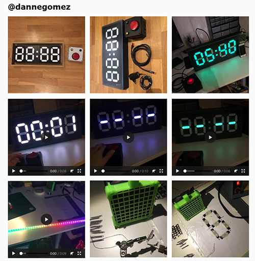

# php-instagram-basic-display-api
Simpel wrapper class for getting posts from Instagram Basic Display API.


Use it to display your feed on your website.


# Requirements
- cURL
- Facebook Developer Account
- Facebook App
- Instagram Access Token

# Get started
To use the Instagram basic display api you need to have a [Facebook app](https://developers.facebook.com) and [Instagram Basic Display](https://developers.facebook.com/docs/instagram-basic-display-api/getting-started) set up.

You also need to register a test user with an [access token](https://developers.facebook.com/docs/instagram-basic-display-api/overview#instagram-user-access-tokens).

After that its easy peasy

```PHP
include 'Instagram.php';
$Instagram = new Instagram('YOUR ACCESS TOKEN');

//get user
$user = $Instagram->getUserData();

//get posts
$posts = $Instagram->getUserMedia();
```


# Screenshot

